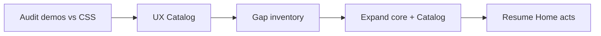

# Catalog + Core Hardening

**Date:** 2026-08-24  
**Status:** Approved — execute in order Audit → UX → Expand  
**Blocks:** Showcase Home catalog-mirrored acts (`2026-08-24-showcase-home-catalog-acts-design.md` deferred)

---

## 1. Problem

The Motion Catalog is still the **live contract surface**, but it drifts from the host-agnostic scene engine and Skin split:

- Demos still teach `vl-pin="top"|"center"` while `03c-scene-engine.css` defines **numeric** pin on `[vl-scene]`.
- Scene engine chips (`vl-stage` / `vl-act` / `vl-span`) appear in notes, but there is **no primary live demo** of track/stage/acts.
- Heavy reliance on legacy `vl-effect` without labeling channel-first authorship (`vl-enter` / `vl-scroll` / `vl-hover` / …).
- Named `vl-scene="…"` recipes sit next to core engine without a clear **Skin recipe** label.
- Optional Catalog JS runtime (play/pause/sliders) can be mistaken for a motion requirement.
- Home/page teaching depends on Catalog anchors and truthfulness — so Catalog must harden **before** page content rewrites.

## 2. Goals

1. **Audit:** Every Catalog demo maps to CSS that ships; obsolete API called out or fixed.
2. **UX:** Stable anchors; clear **Engine** vs **Skins/recipes** lanes; copy matches CONTRACT; JS runtime framed as DX-only.
3. **Expand (after 1–2):** Gap inventory of presets/channels worth adding to `packages/css` **and** Catalog — no silent CSS-only additions.

## 3. Non-goals

- Rewriting Home / Timeline / Skins page content (except links that unblock Catalog UX).
- npm publish / version bump.
- Compiler sugar (`vl-at`).
- Removing Skins recipes from the package (relabel / segregate in Catalog only unless CSS bug).

## 4. Execution order (locked)

### Phase A — Audit

**Sources of truth:** `packages/css/src/**`, `docs/project/CONTRACT.md`, Catalog HTML.

Produce `docs/superpowers/specs/2026-08-24-catalog-audit-findings.md` (or `apps/showcase/output/catalog-audit.md`) with rows:

| Demo / section | Markup used | CSS support | Verdict | Fix |
| --- | --- | --- | --- | --- |

Minimum checks:

- `vl-pin` values vs numeric scene pin
- Presence/absence of `vl-stage` / `vl-act` teaching demo
- `vl-effect` vs channel attributes for the same preset
- Scene named values → `scene-recipes.css` / theme only
- `cube-triad` / experimental blocks vs stage-3d contract
- Deprecated attrs from CONTRACT §2.2

### Phase B — UX Catalog

- Intro: engine (`motion-core`) vs Skins (`theme` + recipes)
- TOC / bussola anchors stable (`#channels`, `#timeline-modes`, `#entrances`, `#stage-3d`, `#scroll`, `#pin` → rewrite or rename to scene-engine, `#hover`, …)
- New or upgraded section: **Scene engine** with pin+scrub + stage/acts (mirror Timeline page, Catalog-sized)
- Relabel recipe scenes as **Skin recipes**
- Runtime toolbar: “optional DX — motion is CSS”
- Lean nav (six routes) if not already

### Phase C — Expand

Only after A+B:

- Gap list: presets in Catalog missing CSS, CSS presets missing Catalog cards, missing engine demos (acts overlap, span, scrub)
- Prioritize engine completeness over visual recipe volume
- Each new preset: CSS in `packages/css/src` + Catalog card + CONTRACT note if stable

## 5. Success criteria

- Audit doc exists with verdicts; P0 fixes applied (broken pin teaching, missing stage demo).
- Catalog visitor can find Engine vs Skins in <30s.
- `pnpm verify:contract` green; Catalog remains a live route.
- Home acts work stays deferred until Phase B done (Phase C can overlap lightly with Home planning).

## 6. Risks

| Risk | Mitigation |
| --- | --- |
| Expanding presets before fixing demos | Hard gate: no Phase C without audit file |
| Breaking archived pages that copy old pin API | Archive is frozen; live Catalog + CONTRACT are truth |
| Scope into full Design Catalog | Out of scope unless motion cards depend on it |
